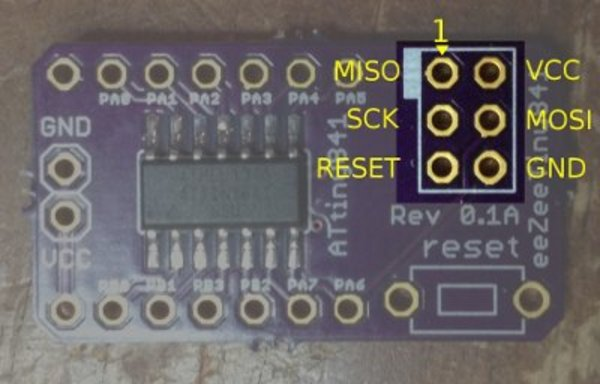

# Hardware Programmer

I recommend flashing your boards with [USBasp](http://www.fischl.de/usbasp/). You can buy clones on eBay at a low cost. Other options I have tried will not work out of the box with Arduino, Atmel Studio, and avrdude.

**Atmel Dragon**: For Atmel Studio or avr-gcc, I've found the [AVR Dragon](http://www.atmel.com/tools/avrdragon.aspx) to be a good out-of-the-box solution that includes debugging.

**USBasp and Atmel Studio**: See this article for setting up Atmel Studio to use USBasp. [[pdf](http://mysinski.wieik.pk.edu.pl/MPUandMCU/Installing%20USBasp%20in%20Atmel%20Studio%20ver%207.pdf)]

## ISP Header Pinout

The following is the standard AVR ISP pinout used on eeZeeTiny boards:

The small, white rectangle next to the ISP header marks pin 1.

[Return to README](README.md)
