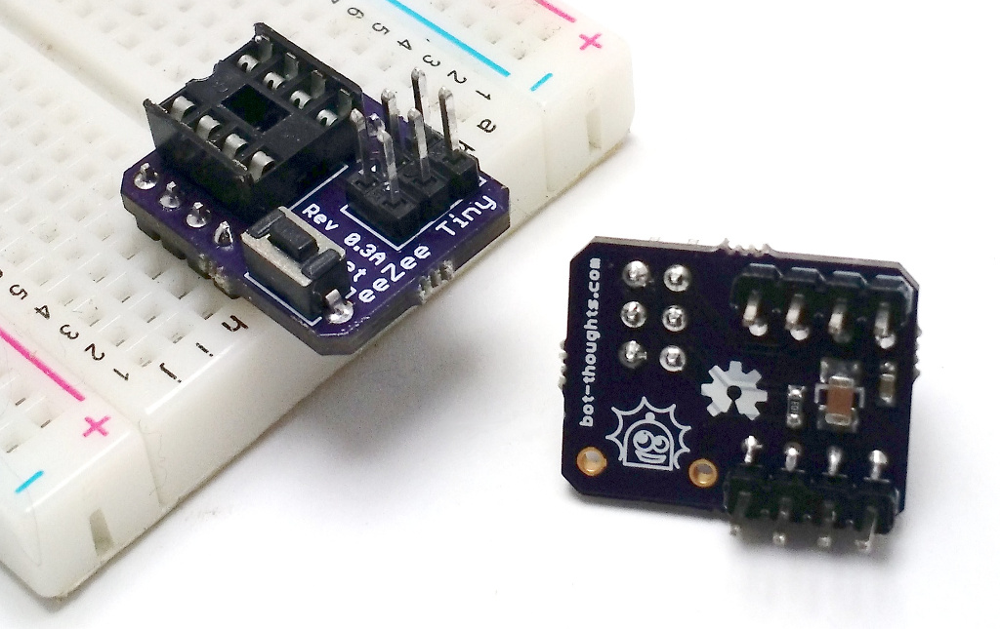
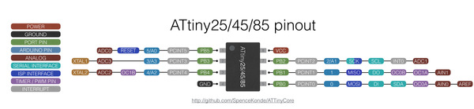

# eeZeeTiny User Guide



## Introduction

The eeZeeTiny is a compact, convenient breadboard development board for 8-pin ATtiny (13, 85, etc.) including AVR ISP header, reset switch and pull-up resistor, and power supply filtering caps. These compact chips are perfect for low power projects, dedicated tasks, Internet of Things, and so much more.

Want one? [Buy now on Tindie](https://www.tindie.com/products/bot_thoughts/attiny85--attiny13-development-board/).

## Pinout



## Getting Started

Click the links below to help you get started with your eeZeeTiny board.

  * First: [Assembling your board](Assembling.md)
  * Next: [You'll need a hardware programmer](HardwareProgrammer.md)

Now, select which environment to use for development:
  * [Getting started with Arduino](Arduino.md)
  * [Getting started with Atmel Studio](AtmelStudio.md) (Windows only)
  * [Getting started with avr-gcc](AvrGcc.md)

## Reference

### Fuses

* I recommend the convenient [Engbedded Fuse Calculator](http://www.engbedded.com/fusecalc/).

### Operating Conditions

Please use your ATtiny breakout boards with regulated supplies of 5V or less, with minimal ripple, at temperatures around 25C (77F). Do not use the boards in high temperature conditions.

### Default Image

During testing, I flash the *larson scanner* example software onto the chip and then test every pin for connectivity. You can find the code in the ```examples``` directory of this repo.
